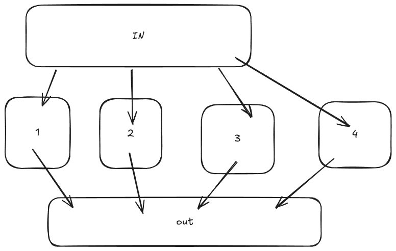

1. 函数式编程是什么
函数式编程是一个不同于OOP的一种编程范式，任何语言都可以使用，他不是一种类似于特定的库之类的方法，相反的任何语言都可以使用他。相比之于OOP那种类似与命令式编程的方式而言，函数式编程更趋向于声明式编程。下面举一段具体的例子，如果使用命令式编程:
```csharp
print(ComposeMessage(1, 2));

string ComposeMessage(int a, int b)
{
    return $"{a} + {b} = {a + b}";
}

void print(string msg)
{
    Console.WriteLine(msg);
}
```

但是如果你使用函数式编程情况就会大不相同
```csharp
Func<int, int, string> ComposeMessage = (a, b) => $"{a} + {b} = {a + b}";
Action<string>print = (s) => Console.WriteLine(s);
print(ComposeMessage(2, 3));
```
通过函数式编程的方法，你可以想搭积木一样的使用小的函数来构成更大的函数来构建应用，他提供和OOP完全不一样的构建应用的技巧。
2. 如何达到函数式编程呢？
+ 首要的是使用表达式而非语句想象一下你有一个int a你需要让a + 10一个常规的想法是
```csharp
int addTen(int a){
    return a + 10;
}
```
如果从函数式的视角来看呢？函数式可以更加简洁的来做到这件事，例如:
```csharp
int addTen(int x) => x + 10;
```
如果这个例子不够直观，看不出来使用函数式编程有什么好处，那么不妨来看下面这个问题:输入一个月份,输出这个月份的
天数，咋一看好像是一个十分简单的问题，但是如果你使用命令式编程，你很有可能得到如下的解决方案:
```csharp
int NumberOfDays(int month,bool isLeapYear)
{
    if(month == 2)
    {
        if (isLeapYear)
        {
            return 29;
        }
        else
        {
            return 28;
        }
    }
    if(month == 1 || month == 3 || month == 5 ||
       month == 7 || month == 8 || month == 10 ||
       month == 10
        )
    {
        return 31;
    }
    else
    {
        return 30;
    }
}
```
看起来可能十分的冗长，但是如果你切换成函数式编程，那么一切便可以大有改观
```csharp
int NumberOfDays(int month, bool isLeapYear) =>
    (month, isLeapYear) switch
    {
        { month: 2, isLeapYear: true } => 29,
        { month: 2 } => 28,
        { month: 1 or 3 or 5 or 7 or 8 or 10 or 12 } => 31,
        _ => 30
    };
```
下面使用一个更加具体的例子来说明函数式编程和OOP的不同之处,假设有一个电影类，其包含了name和genres两个Field，如果想从其中取出对于的genres的电影，如果使用命令式，一个显而易见的编写出的代码如下:
```csharp
var fakeData = new List<Film>
{
    new Film("The Great Chase","action"),
    new Film("A Quiet Reflection","drama"),
    new Film("Desert Storm","action"),
    new Film("The Family Secret","drama")
}; 
record File(string name , string genres);
```

```csharp
IEnumerable<Film> GetFilmsByGenre(string genre)
{
    var chosenFilm = new List<Film>();
    
    foreach (var f in fakeData)
    {
        if(f.genre == genre)
        {
            chosenFilm.Add(f);
        }
    }
    return chosenFilm;
}
```
显然这个函数不够优雅并且还一次性的写出了所有选的类型的电影，不必要的占用了大量的内存，所以你想到了第一种的改进方法
```csharp
IEnumerable<Film> GetFilmsByGenre(string genre)
{
    
    foreach (var f in fakeData)
    {
        if(f.genre == genre)
        {
            yield return f;
        }
    }
}
```
显然，这下不需要全部获取对应的，使用yield可以一个一个的得到Film，但是使用函数式编程，这个可以更加的优雅
```csharp
IEnumerable<Film> GetFilmsByGenre(string genre) => fakeData.Where(x => x.genre == genre);
```
对于常见的初始化的方法在函数式编程的方案可以和常见的OOP的方案有所不同，可以如下面的初始化方法
```csharp
var a = Enumerable.Range(1,10)
var s = string.Join(",",a)
```
这样就可以完成从1-10的List,并且可以转化为string，并且可以从打印9x9的乘法表，并且可以使用下面的方案来代替以往的生成的9x9的乘法表。（下面是生成一个5x5的表格）
```csharp
var nineTimesTable = Enumerable.Range(1,5)
                        .SelectMany(x => Enumerable.Range(1,5)
                        .Select(y => (X : x , Y : y))
                        );
```
得到的是(1,1),(1,2),(1,3),(1,4),(1,5),(2,1),(2,2).....
如果想要得到相反的(5,5),(5,4),(5,3),(5,2) .....，那么可以这么来实现
```csharp
var gridCoords = Enumerable.Repeat(5,5).Select((x,i) => x - i)
                .SelectMany(x => Enumerable.Repeat(5,5)
                    .Select((y,i) => (x,y-i))
                );
```
一个更加有效的的改进是可以以下面这个验证器作为例子，如果使用OOP的方式来判断密码的验证函数是否有效可以简单的写出如下的代码
```csharp
public bool IsPasswordValid(string password){
   if(password.Length <= 6){
    return false;
   } 
   if(password.Length > 20){
    return false;
   }
}
```
但是如果使用函数式编码的方式来重构这段代码，就可以写出如下的代码:

```csharp
public bool IsPasswordValid(string password) => 
    new Func<string,bool>[]
    {
        x => x.Length > 6,
        x => x.Length <= 20
    }.All(f => f(password));
```

但是这个还是不够优雅，我们可以将.All()方法剥离出来，形成一个泛型的扩展方法，从常识上面可以看出，
我们需要的验证函数是Func<T,bool> rule显然其入参是一个泛型T,其返回值是一个bool,然后根据学习的C#知识可以得到:

```csharp
static class ValidExtensions
{
    public static bool IsPasswordValid<T>(this T @this , params Func<T,bool>[] rules) => rules.All(rule => rule(@this));
}
```

然后验证方法就可以简单的写出如下的代码:
```csharp
bool IsPasswordValid(string password) =>
    password.IsPasswordValid(
        x => x.Length > 6,
        x => x.Length < 10
    );
```

同样的如果验证其不是Valid的呢，便可以写出下面的泛型方法:

```csharp
public static bool IsPasswordInvalid<T>(this T @this, params Func<T,bool>[] rules) => rules.Any(rule => !rule(@this));
```

3. 一些常见的函数式的编程方法
fork combinator使用多种方式处理单个数值，如下面的一个典型的例子:
```csharp
var triangle = (300, 400);
var hypotenuse = triangle.Fork(
    x => Math.Pow(x.Item1,2),
    x => Math.Pow(x.Item2,2),
    (s , b) => Math.Sqrt(s+b)
);
public static Tout Fork<Tin, T1, T2, Tout>(
        this Tin @this,
        Func<Tin, T1> f1,
        Func<Tin, T2> f2,
        Func<T1, T2, Tout> fout)
    {
        var p1 = f1(@this);
        var p2 = f2(@this);
        var result = fout(p1, p2);
        return result;
    }
```
显然这是一种将多个数值转为单个数值并且执行之后聚合的例子，将三角形的两条边每条边分别计算其平方(这里不是并行)，然后再聚合的方法，当然这里的函数只使用了两个，并且一般的我们可以将函数扩展到无数个分开的函数然后再进行聚合，其具体的实现如下:
```csharp

    public static TEnd Fork<Tin, TMid, TEnd>(
        this Tin @this,
        Func<IEnumerable<TMid>, TEnd> joinFunction,
        params Func<Tin, TMid>[] prongs)
    {
        var intermediateValue = prongs.Select(x => x(@this));
        var result = joinFunction(intermediateValue);
        return result;
    }
```
具体的编程流程可以有如下的流程来展示:

第二个可以使用的是Alt组合子，将相同的目标函数绑定在一起，然后将参数依次的开始执行，如果有一个成功就成功，这个类似于Or方法，下面是C#代码的具体的实现
```csharp
   public static TOut Alt<TIn, TOut>(
        this TIn @this,
        params Func<TIn, TOut>[] args) =>
        args.Select(x => x(@this))
            .First(x => x != null);
```

